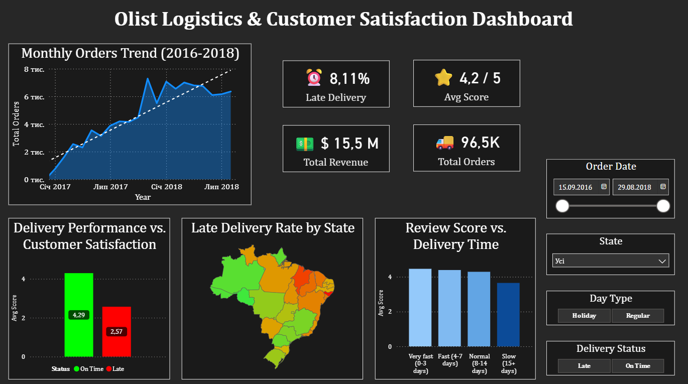

# **Analysis Brazilian E-Commerce Public Dataset by Olist**
## 1. Project Overview & Business Problem
This project will analyze the Olist E-commerce dataset, a real dataset containing over 100,000 orders from a large Brazilian marketplace. The data is distributed across 8 separate tables, including information on orders, products, payments, deliveries, and customer reviews.

The Business Goal: The primary objective is to investigate the relationship between logistics performance and customer satisfaction. We will be looking for evidence to answer one key question: "How much do delivery-related issues (like delays, shipping costs, and speed) impact negative customer review scores?"
## 2. Tech Stack
* ### Database: SQLite
* ### Data Extraction & Transformation: SQL
* ### Data Analysis & Enrichment: Python (Pandas, Matplotlib, Seaborn)
* ### Business Intelligence & Visualization: Power BI (or Tableau)
* ### Environment: Jupyter Notebook, VS Code
## 3. Analysis Steps

### 1. Data Preparation & Integration:
* Load all 8 original Olist CSV files into a local SQLite database to create a relational structure. This mimics a real-world production environment where data lives in tables, not flat files.

### 2. Data Extraction (SQL):
* Write a single, comprehensive SQL query using **CTEs (Common Table Expressions)** to aggregate items and payments to avoid data duplication.
* Use **`LEFT JOIN`** to combine data from the necessary tables (`orders`, `order_items`, `reviews`, `customers`, `payments`) into one unified dataset.
* Filter the data to retrieve only valid, completed orders (`order_status = 'delivered'`), preparing a raw but clean dataset for Python processing.

### 3. Data Transformation & Enrichment (Python):
* Load the raw extracted data into a **Pandas DataFrame**.
* **Feature Engineering:** Calculate new business metrics using Python:
    * `time_to_deliver_days`: Calculate the actual delivery duration.
    * `is_late`: Determine if the delivery was delayed compared to the estimated date.
    * `freight_to_price_ratio`: Analyze shipping costs relative to the product price.
* **External Data Enrichment:** Add external data (e.g., Brazilian national holidays) to create the `is_holiday_purchase` column for deeper analysis.
* **Exploratory Data Analysis (EDA):** Conducted a deep-dive statistical analysis to uncover correlations between logistics failures and customer churn.
* **Data Export:** Prepared and exported a clean, enriched dataset optimized for visualization in Business Intelligence tools (Power BI).

### 4. Data Visualization (Power BI):
* Import the final, clean CSV into Power BI.

* Build an interactive dashboard to visually answer our key business question. The dashboard will include:

    * KPIs (Total Sales, Avg. Review Score, % Late Deliveries, Total Revenue)

    * A map showing logistics performance by region.

    * Charts showing the direct impact of delivery_status on review_score.
    
## 4. Interactive Dashboard 📊

I developed an interactive Power BI dashboard to visualize the insights.
**Click the image below to explore the live dashboard:**

*(Note: The dashboard is hosted on Power BI Service using "Publish to Web". If the link doesn't open, please check your firewall settings).*

## 5. Data Source
The 8 raw .csv files for this project are not included in this repository due to their large size (>100MB).

You can download the original dataset directly from Kaggle:
https://www.kaggle.com/datasets/olistbr/brazilian-ecommerce

To run this project, please download the files and place all 8 .csv files into the data/raw/ directory. The notebook will then load them into the SQLite database from there.